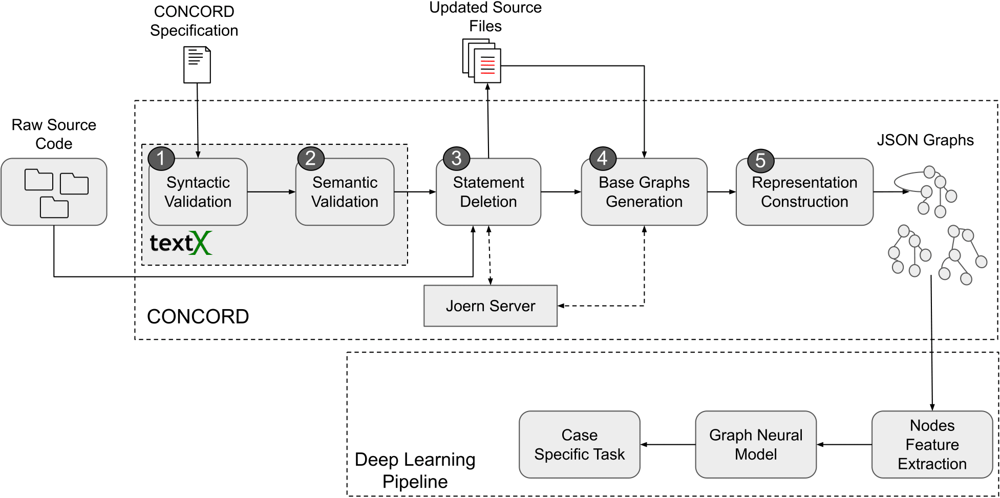

# Replication Package of CONCORD
## CONCORD: A DSL and Configurable Framework for Code Representation

### Abstract
In recent years, deep learning techniques have been widely used in source code analysis applications to discover latent patterns in large code corpora. To use deep learning techniques on source code, it is important to first represent source code in a format that captures its characteristics and features relevant to the code analysis application. Graph-based code representations have gained significant attention due to their ability to model various structural and semantic information. However, this approach poses several challenges. 
Specifically, existing methods do not provide the flexibility to construct graphs from source code in a cross-linguistic manner, limiting them to one or two programming languages. Additionally, the output of existing tools is often not interoperable. Moreover, the generated graphs are often overly complex in size, making graph-based neural networks slower to train and less scalable.

In this work, we introduce CONCORD, a domain-specific language (DSL) and framework designed to build customizable graph representations of code by combining various base code representations. It implements two graph reduction heuristics to address the issue of graph size complexity. We demonstrate the effectiveness of our tool on the task of code smell detection as an illustrative use case and show that: first, CONCORD can produce code representation automatically as per the specified configuration, and second, our heuristics can achieve comparable performance with significantly reduced representation. CONCORD will help researchers reduce the engineering work needed when conducting graph-based source code analysis research and address the issue of scalability when training Graph Neural Network models.

### Folder Structure
This replication package contains three major parts: the source code of the DSL, the implementation of the GNN model used in the experiment, and the data that was generated using CONCORD used to train the GNN model. 
- `data`: contains the generated data by CONCORD and used in the experiments.
- `dsl`: contains the source of CONCORD. Please check the README.md file at that folder for more information on how to use the language.
- `experiments`: contains the implementation of the GNN models.